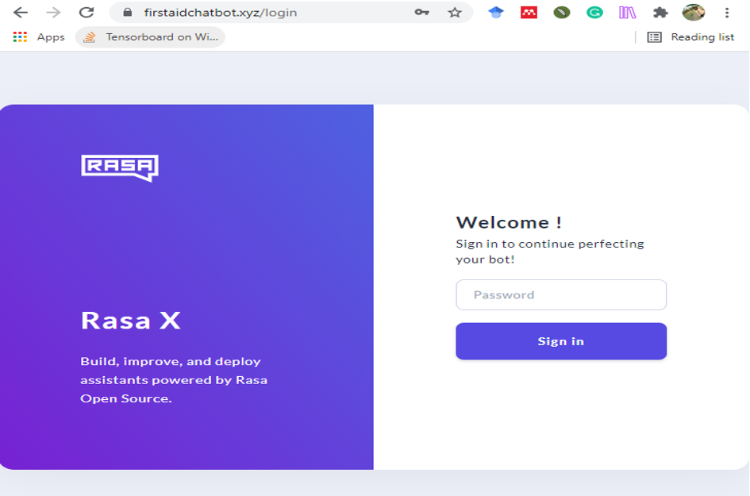
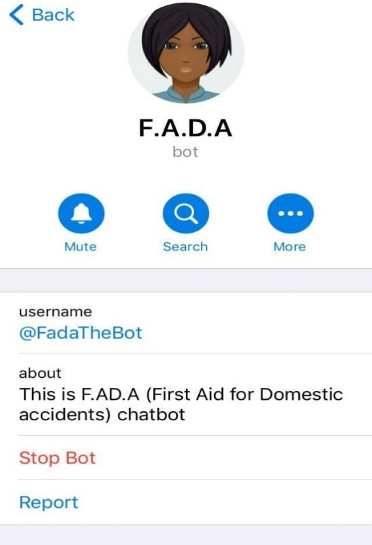
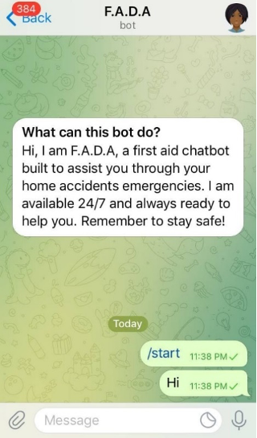
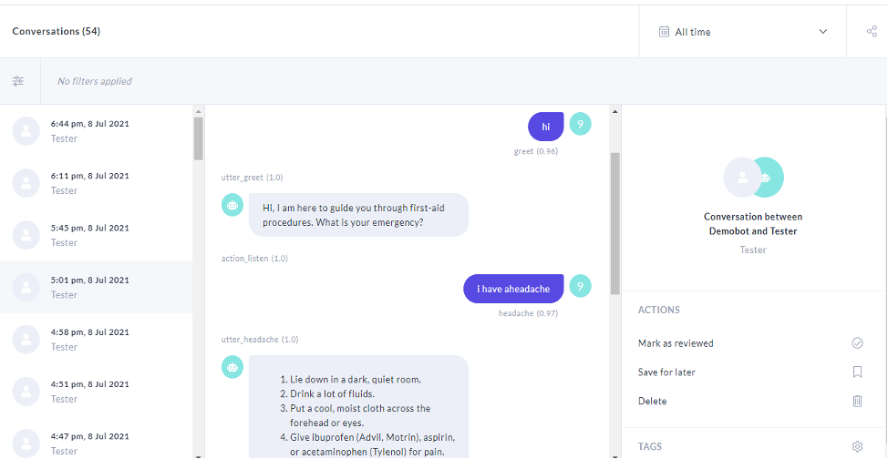
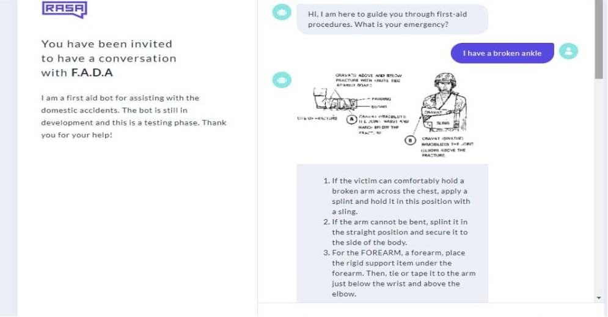

# <h2 align="center">FADABOT</h2>

## Description :house:

A first-aid chatbot for providing treatments for 70 domestic accidents common to Nigerian homes.
The chatbot model was built with the Rasa NLP framework,

---

## DEPLOYMENT

The chatbot model was hosted on a Digital Ocean droplet and can be accessed through the RASA X server for tuning and updates.

 

<h3 align="center">
    <b>Model Server Deployed on firstaidchatbot.xyz</b>
    
</h3>
 
-----

<h3 align="center">
   <b>Chatbot's Profile on Telegram</b>
    
</h3>

##  

<h3 align="center">
   <b>Chatbot's chat Interface on Telegram</b>
    
</h3>

 

## USER TESTING

<h3 align="center">
   <b>1. User testing on RASA X server</b>
    
</h3>

##  

<h3 align="center">
   <b>2. User Interaction about broken arm </b>
    
</h3>

 
